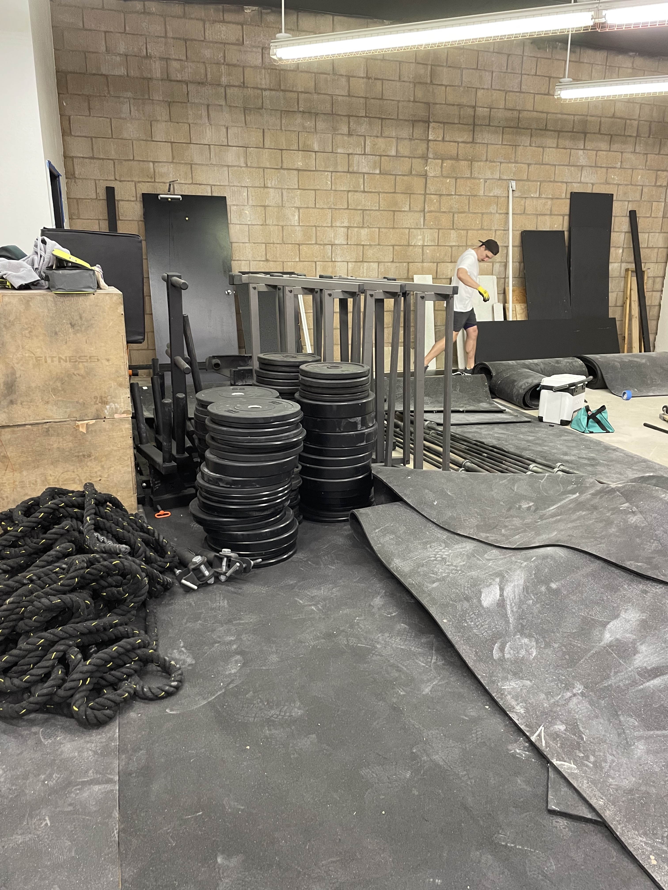

Welcome back to my second blog post!

****DISCLAIMER* I have bad writing skills and poor grammar so please bear with me. I am just doing this for fun. and 
this blog post quickly escalated because I have so much on my mind lol please enjoy, or not. up to you***

###### Wrist Check ###### 
>I got on my trusty Seiko SPB143 that I picked up earlier this year :) 

I feel like I had a bunch of ideas for my second blog post, but totally forgot what they were ¯\_(ツ)_/¯
So I think I shall just write about how the past year has gone for me! Today is actually a pretty significant day in
the life of Ronald Tran! I am celebrating my 1 year anniversary of my first full time career job with Raytheon :) 

I've ran through a couple scenarios of possible ways to celebrate in the last year (probably was just looking for a
reason to treat myself lol). I think as of today, 10/03, I will combine my work anniversary with my upcoming twenty-fifth 
birthday (11/06) and buy myself my first brand new watch from an AD/boutique. The idea was put into my mind by my mom! 
Something my mother and I have always enjoyed was window shopping and frequently visiting the mall just to walk and talk, 
usually after a nice lunch and coffee break on a Friday afternoon. **If you're reading this, you probably know how much
love and passion I have for timepieces (at this point I am probably synonymous with watches to you lol).** As usual, I 
am just spouting out random fun facts about watches to her (*as one does*), and she asks me if I would buy a new Rolex 
or a new watch, and I am stunned. As long as I have been into watches, I have only considered buying pre-owned or used 
watches as that was what I could afford with no real job/income. The thought of going into a boutique or an AD was not 
even a possible scenario in my head! ME?! ***A (24 year old) kid who barely knows how to keep his fridge stocked??*** The 
thought of it seemed ridiculous at first, but in the few seconds that it sat in my 100mph mind, I realized "huh, why not?".
In that moment I made it my goal to do it by the end of the year to celebrate whatever I could think of lol. So here I am!
Getting ready to make this big purchase, counting down the days! I mean why not? I have the means of doing it while 
still functioning as a self sufficient adult!

>photo of my empty fridge lmao. this is actually a lot of food at once in my fridge.
>the fridge of a self sufficient adult, who needs food when you have film???

######  Writing/Reading break! #######
> Where am I now? You're probably not wondering but I'll let you know anyways lol. I think it'll be fun to keep track of 
> where I am as I write these little pocket thoughts.
> Currently at Mugs Coffee Shop in Walnut with VF on this beautiful Monday. Was supposed to help fix her flat tire 
> butttttt we decided to ditch effort and go to some studying/werk, which seems a lil bit more fun lol. She is studying 
> diligently, so impressed... I could learn a thing or two from her work ethic lol. KEEP IT UP V YOU'RE AMAZING!!!
> Anyways back to our regularly scheduled programming! *remote click noise*

## ANYWAYS, lets talk about the past year!!! ##
#### part I: the beginning? ####
Ah, this past year was bumpy... started off super strong though!!! (Plan on ending in a similar fashion) A year ago I was 
ending my hiatus from life (which was absolutely amazing and I recommend everyone do it at least once in their life, I'll
write about the hiatus next time. Good idea Ronald, nice), so I felt that I was in the right head space to start this 
next chapter of my life! Wouldn't call "starting my life" like I used to because life is so so much more than work! 

###### HEY YOU, YOU ARE SO MUCH MORE THAN JUST A JOB AND DONT FORGET THAT KID! Love you and you're doing great, keep it up :) ###### 

Anyways, I am ready to start work and I start looking to learn more about growth and life! What better way than moving out and 
taking on that responsibility of keeping myself alive lol. So that is EXACTLY what I do, and what do I know about living 
alone and taking care of myself? Not much but f*ck it we learn as we go. hmmm I wondered what other challenges could stack
on there because why not? OH HOW BOUT A MARATHON!

>sidebar
>Earlier last year, during my hiatus I was thinking hm lets do something I never thought I could do, A MARATHON. and when would
>that marathon be? oh the day after my birthday??? HOW SYMBOLIC! start my 24th year doing something incredibly hard that I 
>never thought/was told wasn't possible. Trained for 7 months and super proud. Here I am with one of my favorite people in the world
>the shaka runner himself JP!!!!!!!!! Love you king 
>

That weekend of my birthday/marathon/middle of apartment hunting, I land an apartment!!! Damn what a birthday lol. So for 
my 24th year of life, I start it with the challenges of running a shit ton of miles and packing up my life for a new(?) start
in a place where I have always wanted to live! So as you can see I started on top of the world and super strong :) 

>another sidebar in my 100mph mind, sorry bare with me please
>Now I am thinking of the people in my life that make life so great, I shall have to dedicate posts/a post to these heroes
>of mine in the future. Stay tuned folks! *remote click noise again*

#### part II: Calculated Risks ####

I think a big theme of this year was take **calculated risks**. I'm not talking about anything reckless like idk 
jumping off of tall shit or anything wild like that lol, but rather dip ye toes in unknown waters or putting yourself 
outside your comfort zone! Starting with a marathon really set the tone which was nice. Like what could be harder than 
that lol. WELL LEMME TELL YA. Confrontation.

###### Confrontation/Communication #######
I have had a couple instances that I found memorable. I had to have serious talks with friends about how I have felt, 
whether they be about feelings of anger, happiness, love, etc... I shan't go into details, BUT lets talk about what I 
have learned. Communication is so so important in any healthy and happy relationship, whether it be with family, friends,
significant others, or even yourself. For me, being able to communicate my feelings has been something I have always 
struggled with. I found myself always putting my feelings to the sides so I could make everyone else happy (staying out 
even though I was tired, driving drunk friends around, acting not like I had any input on a given situation just so the 
other parties could be happy, etc) and I found myself tired all the time, and tbh not as happy as I could be. These
feelings became feelings of resentment and anger, which I hated. I just wanna be happy :/ so what do you did I do?? 

| step number | Title                                    |  
| :----- | :--------------------------------------- | 
| 1      | sat down with myself and asked myself the important questions to find the source of my problems | 
| 2      | sat down with the people related to communicate  | 
| 3      | clear the air and learn | 

>I am not sure if this is the "right" way to do things, but it what worked for me! Hopefully you have a good way of 
>dealing with these kinda things! If not maybe you can take this and make it work for you? idk, I'm not pro, but I want
>you to be happy with your life :) you deserve nothing less than the best and don't ya forget it!

*In the end* I am very happy with myself and how I have dealt with my struggles this year! BUT something else I have 
learned is that communication and opening up can lead to some of the most beautiful things in life. Growing up I was 
never talking to anyone about my life or how I felt. Especially not my parents, and I know now that they always cared to
know. In the past two years I feel that I have grown like crazy. I don't feel like a kid anymore and I love it. This year
I can proudly say that I have grown so much closer to my parents. Did it all by just opening up and really letting them 
into my life. As I said earlier in this ever-growing post, my mother and I try to get lunch and coffee once a week. Wasn't
something we intentionally planned, but became an unspoken routine in our week since I started working , and I love it 
:) After about 6 months of this, she asked me about my life, and for the first time in my life I was totally honest 
and let her into my life. It was one of the most freeing moments in my life. 

I was able to tell my mom about what's happened to me and just how my life is. I told her I was happy for the first time
in my life, how I felt like I have grown, my romantic life (ewwwwwwwww cooties, jk im a mature adult as you've seen), 
and just about anything :) Unlocking this part of our relationship as lead to deep and rich talks that I could sit in 
forever. Now that I think about it I was able to do this with so many relationships in my life that I never expected! I 
guess moral of the story, learning to communicate has added so much value and richness to my life that I never knew 
possible :) I can only hope that everyone can experience this in their own lives. Truly one of the most beautiful things
in life <3

>My amazing mother on one of our amazing friday lunch/coffee/life enriching talks! She also tells me to buy stuff which
> I love lol. My enabler
>

###### Skills I have picked up ######

Oh man!!! Something else I would like to talk about is things I've learned in terms of skill sets!!! I would apologize 
for how long I am making this post, but I am trying to practice apologize less especially because I say sorry for no 
reason tbh. but rather I shall say thank you for going along with my book of a blog post lol. 

But yes, skills I have learned! Lets list em out!

> ## Skills I have learned this past year in the order that I remember them in lol
> 1. Construction stuff! (Tiling, electrical stuff, drywall, building shit, getting my hands dirty) learned all this when I helped my homies at my favorite place in the world, Gate14, build their/our new home :)
> 2. Working on cars! Oh man, couldn't have done this without my hero/legend Steve H. Anyone who knows me will know how much I love and look up to this man lol. He can do anything!!! and hes got the coolest watches and cars in the biz 
> 3. Communication as stated above lol.
> 4. Supporting myself!!!
> 5. Putting myself out there!!!!
> 6. probably more stuff but lets stop there. I could go on forever. these are what im super proud of lol

Ah something I have truly been able to appreciate this year is the importance of skills that require some blood, sweat, 
and tears. From building gyms to working on cars, I tried to tackle as many hand based projects as I could! I call it "Dad
In Training Skills". I think these skills really just added so much to my life mentally and physically. I really feel like
I can figure anything out now, and I just appreciate hard work so much more. One of my dreams growing up was to be the 
best dad/husband/partner ever. I want to be someone people can rely on or go to for help! Like Steve H!!! Literally the 
coolest guy ever :) He said I am on the right track to being that man and that is all I have ever wanted to hear :) Thanks Steve

>Some images from the gym during construction!!! so so proud of this and all the hard work we put into it!!!
>
>the new space
>
>
>breaking things down to build something new
>
>
>Derek and I working on gutting the bathroom to get it nice and sexy.
>
>
>hand built front desk and island 
>
>
>trying to be organized
>
>
>basically bob the builders 
>
>
>bathroom progress
>
>
>

#### part III: Dealing with Loss ####

Dealing with loss... not easy. This year I have gone to more funerals than I would've liked to. Death and losing people
is something you just can't avoid. I've dealt with death on so many levels, and each time it hits hard. Unfortunately, 
one new way that I recently discovered, was watching someone you love die. I guess I was kinda prepared for this, as I 
read the book, *Tuesdays with Morrie*, which is is about watching someone die slowly. One of my closest and dearest 
friends was diagnosed with cancer last year and it has been something that has been on my mind since he told me. I thought 
that it was gone, but recently during a lunch with him, he told me it would never go away and he is on the clock... this 
has been something that has sat in my mind like a weight since he has told me. Fortunately, he has a couple years which 
you could argue is a lot of time, but something I firmly believe in is that no amount of time will ever be enough to spend 
with someone you love. Therefore I shall make the most of every single moment I spend with him and everyone I love. Life 
something truly fragile and I will never ever miss the chance to spend quality with someone again. Of course life happens
and I might forget that, but I will always try my best to be fully present in the moments I have with the people I love. 
***Rather than think about my time with the people I love at fleeting moments, I will approach this time has treasure and 
truly cherish it forever.*** 

This post is for you FA and everyone I love. 

#### part III: Conclusion? ####

hmmmmmm I think I have covered a lot of what I wanted to talk about this past year. I hope you guys were able to take 
something away from it or at least enjoy a glimpse into a tiny sliver of my life. Who knows what happens next, 
and I still got a month till my 24th year in life is done. Maybe I will have more to report. In the end though, I am
so happy. If you're reading this you contributed to it just by being alive in this beautiful world. Thank you for including 
me in your life today by reading this mess of thoughts I decided to jot down on this gorgeous Monday afternoon. Anyways,
I shall go enjoy the rest of the day with the people I love. (Just wanted to say this for myself, but I am one of those
people I love :) I love myself very much and I hope you love yourself too because I love you)

Thanks for the chance to checkup on a happy soul [watch lover, camera enthusiast, life enjoyer, etc.]

-ronald

 